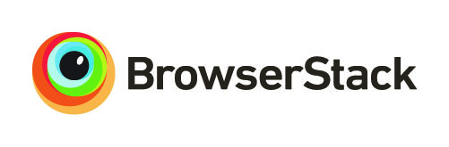

###[Go Back](README.md "README")
#WEB OPTIMIZER
##Credits

- Thanks to Google for the [Closure Compiler API](http://developers.google.com/closure/compiler/ "Closure Compiler Documentation"), which is critical to the JavaScript parser.
- Thanks to jQuery for [their code](http://jquery.com/ "jQuery Website"), which is implemented in the developer version. 

- Special thanks to BrowserStack for sponsoring this project and giving it more substantial cross-browser capabilities.